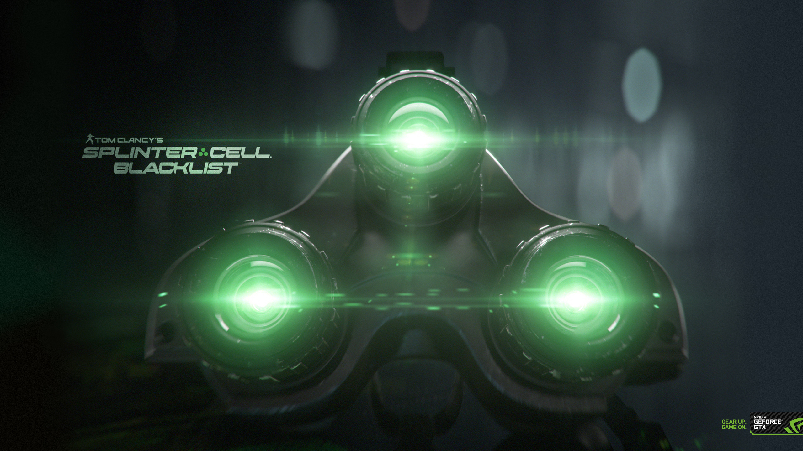

# Shortcut Syntax Test Document

This document tests all shortcut syntaxes to ensure they work correctly.

---

## View

## File

### Standard Markdown (Control Group)
# Standard H1
## Standard H2
### Standard H3

### Shorthand (h1: through h6:)
h1: Shorthand H1 Header
h2: Shorthand H2 Header
h3: Shorthand H3 Header
h4: Shorthand H4 Header
h5: Shorthand H5 Header
h6: Shorthand H6 Header

### Full Word (heading1: through heading6:)
heading1: Full Word H1 Header
heading2: Full Word H2 Header
heading3: Full Word H3 Header

### HTML-like
<h1>HTML-like H1 Header</h1>
<h2>HTML-like H2 Header</h2>
<h3>HTML-like H3 Header</h3>

### BBCode-style
[h1]BBCode H1 Header[/h1]
[h2]BBCode H2 Header[/h2]
[h3]BBCode H3 Header[/h3]

### Semantic Aliases
title: This is a Title (H1)
subtitle: This is a Subtitle (H2)
section: This is a Section (H3)
subsection: This is a Subsection (H4)

---

## 2. Text Formatting Shortcuts

### Bold

This is **standard bold** text.

This is <b>HTML-like bold</b> text.

This is [b]BBCode bold[/b] text.

This is :bold:colon wrap full bold:bold: text.

This is :b:colon wrap short bold:b: text.

This is b{brace wrap bold} text.

### Italic

This is *standard italic* text.

This is <i>HTML-like italic</i> text.

This is [i]BBCode italic[/i] text.

This is :italic:colon wrap full italic:italic: text.

This is :i:colon wrap short italic:i: text.

This is i{brace wrap italic} text.

### Strikethrough

This is ~~standard strikethrough~~ text.

This is <s>HTML-like strikethrough</s> text.

This is [s]BBCode strikethrough[/s] text.

This is :strike:colon wrap full strike:strike: text.

This is :s:colon wrap short strike:s: text.

This is s{brace wrap strike} text.

### Bold + Italic

This is ***standard bold+italic*** text.

This is <bi>HTML-like bold+italic</bi> text.

This is [bi]BBCode bold+italic[/bi] text.

This is :bi:colon bold+italic:bi: text.

This is bi{brace bold+italic} text.

---

## 3. Link Shortcuts

### Standard Markdown
[Standard markdown link](https://example.com)

### Shorthand with custom text
link: Click here for example | https://example.com

### Shorthand auto-link
link: https://example.com

### HTML-like with text
<link href="https://example.com">HTML link with text</link>

### HTML-like auto
<link>https://example.com</link>

### BBCode with text
[url=https://example.com]BBCode link with text[/url]

### BBCode auto
[url]https://example.com[/url]

---

## 4. Image Shortcuts

### Standard Markdown


### Shorthand with alt text
img: Alt text here | Sa8wd6.jpg

### Shorthand simple
img: Sa8wd6.jpg

### HTML-like full


### HTML-like simple
Sa8wd6.jpg</img>

### BBCode with alt
[img=Sa8wd6.jpg]BBCode image alt text[/img]

### BBCode simple
[img]Sa8wd6.jpg[/img]

---

## 5. Code Shortcuts

### Inline Code

This is `standard inline code`.

This is <code>HTML inline code</code>.

This is [code]BBCode inline code[/code].

This is :code:colon inline code:code:.

This is c{brace inline code}.

### Code Blocks

**Standard Markdown:**
```javascript
function hello() {
    console.log("Standard markdown code block");
}
```

**Shorthand with language:**
code: javascript
function hello() {
    console.log("Shorthand code block with language");
}
endcode:

**Shorthand without language:**
code:
Plain text code block
No language specified
endcode:

**HTML-like:**
<code language="python">
def greet(name):
    print(f"Hello, {name}!")
</code>

**BBCode with language:**
[code=javascript]
function greet(name) {
    console.log(`Hello, ${name}!`);
}
[/code]

**BBCode without language:**
[code]
Plain text in BBCode
No language
[/code]

---

## 6. List Shortcuts

### Unordered Lists

**Standard Markdown:**
- Item 1
- Item 2
- Item 3

**Shorthand ul:**
ul: Unordered list item 1
ul: Unordered list item 2
ul: Unordered list item 3

**Shorthand list:**
list: List shorthand item 1
list: List shorthand item 2

**Bullet character:**
• Bullet character item 1
• Bullet character item 2

### Ordered Lists

**Standard Markdown:**
1. First item
2. Second item
3. Third item

**Shorthand ol:**
ol: Auto-numbered item 1
ol: Auto-numbered item 2
ol: Auto-numbered item 3

**Hash auto-number:**
#. Hash auto item 1
#. Hash auto item 2

### Task Lists

**Standard Markdown:**
- [ ] Unchecked task
- [x] Checked task

**Shorthand task:**
task: Unchecked task item
task: x Checked task item

**Shorthand todo/done:**
todo: Todo task item
done: Completed task item

**BBCode:**
[task] BBCode unchecked task
[done] BBCode completed task

---

## 7. Blockquote Shortcuts

### Standard Markdown
> Standard markdown blockquote

### Shorthand quote
quote: Shorthand quote text

### Shorthand bq
bq: Shorthand bq quote text

### HTML-like
<blockquote>HTML-like blockquote</blockquote>

### BBCode
[quote]BBCode blockquote text[/quote]

---

## 8. Horizontal Rule Shortcuts

### Standard Markdown
---

### Shorthand hr
hr:

### Shorthand divider
divider:

### HTML-like
<hr>

### BBCode
[hr]

---

## 9. Mixed Content Test

h2: Testing Multiple Shortcuts Together

This paragraph has <b>bold</b>, <i>italic</i>, and <s>strikethrough</s> text.

It also has [url=https://example.com]inline link[/url] and  inline.

quote: This is a quoted section with **bold** and *italic* text inside.

ul: List item with [b]bold[/b] text
ul: List item with [i]italic[/i] text
ul: List item with [s]strike[/s] text

task: Task with <code>inline code</code>
task: x Completed task with :b:bold:b: text

---

h1: End of Shortcut Test Document

All shortcuts have been tested above!
